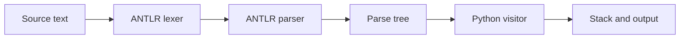

# ⌨️ Forth Interpreter with ANTLR


[](https://github.com/Gen765/forth-interpreter-antlr/actions/workflows/ci.yml)
[](LICENSE)

A small interpreter for a Forth-like stack language, written in Python. ANTLR
handles the grammar and parse tree; my handwritten visitor in `visitor.py`
implements the stack, built-in words and user definitions.

## 🏗️ Interpreter architecture



The generated lexer, parser and base visitor are committed, so using the
interpreter does not require Java or an ANTLR download. Each call to
`interpret(source)` creates a fresh stack and dictionary.

## ✨ Supported language

| Category | Words and syntax |
| --- | --- |
| Arithmetic | `+`, `-`, `*`, `/`, `mod` |
| Comparison and logic | `<`, `>`, `=`, `<>`, `<=`, `>=`, `and`, `or`, `not` |
| Stack | `dup`, `drop`, `swap`, `over`, `rot`, `2dup`, `2drop`, `2swap`, `2over` |
| Definitions | `: name ... ;`, recursive calls and `recurse` |
| Control flow | `if ... else ... endif` inside definitions |
| Output and comments | `.`, `.s`, `( ... )` |

Syntax errors, stack underflow, division by zero and undefined words are
reported as readable messages.

## ▶️ Example

```text
> 5 8 + .
13

> : square dup * ;
> 6 square .
36
```

From Python, the same interpreter can be called directly:

```python
from forth import interpret

interpret("2 3 + .")
interpret(": double 2 * ; 5 double .")
```

## 🚀 Quick start

```sh
python -m venv .venv
# PowerShell: .\.venv\Scripts\Activate.ps1
# Linux/macOS: source .venv/bin/activate
python -m pip install -r requirements.txt
python cli.py --code ": square dup * ; 9 square ."
```

The CLI also accepts a UTF-8 file or standard input:

```sh
python cli.py examples/basics.forth
echo "6 7 * ." | python cli.py
```

## 🧪 Tests

```sh
python -m unittest discover -s tests -p "test_*.py" -v
python -m doctest tests/test.txt -v
```

The unit tests cover arithmetic, stack words, definitions, recursion,
conditionals, errors and the command-line interface.

### Regenerating the parser

Regeneration is only needed after changing `forth.g4`. It requires Java and the
development requirements:

```sh
python -m pip install -r requirements-dev.txt
make generate
make test
```

The generator and Python runtime are pinned to ANTLR 4.13.2. More detail is
available in [`docs/architecture.md`](docs/architecture.md).

### Current limitations

- There are no loops or persistent REPL state.
- Conditionals are accepted only inside definitions.
- Comments cannot be nested.
- Integer division follows Python floor-division semantics.
- A failed operation may already have popped values from the current stack.

## 💡 What I learned

- How to keep grammar rules separate from execution semantics.
- How ANTLR's visitor pattern maps a parse tree onto a stack machine.
- Why recursion, error recovery and stack mutation need focused tests.

I originally wrote this as an individual FIB-UPC exercise. It is available
under the [MIT License](LICENSE); ANTLR keeps its own licence as noted in
[`THIRD_PARTY_NOTICES.md`](THIRD_PARTY_NOTICES.md).
